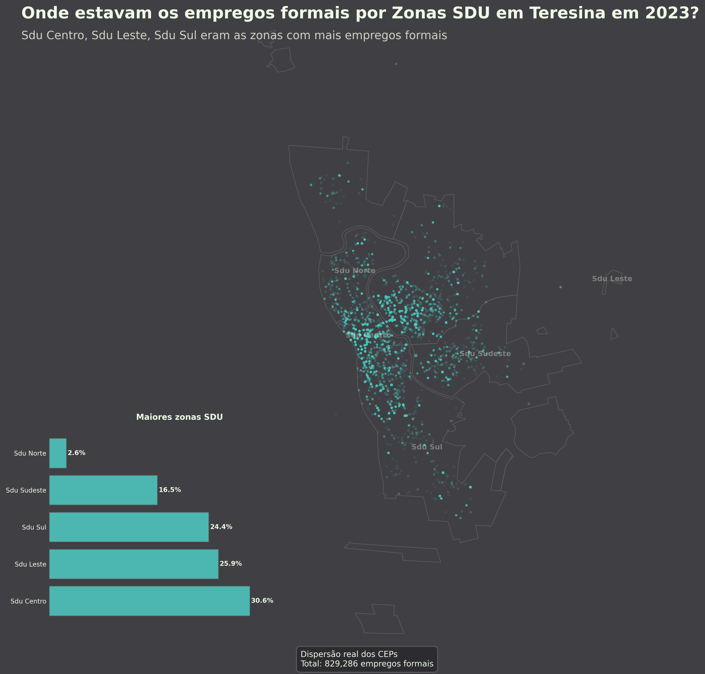

Mapa do Emprego Formal em Teresina (RAIS)
=========================================

Projeto aberto voltado para aprendizado em economia e análise espacial do mercado de trabalho.
Usa dados da RAIS para visualizar a distribuição de empregos formais por CEP e por bairro em Teresina/PI. Agora também inclui a visualização por Zonas SDU da Prefeitura.

Objetivos
---------
- Facilitar o estudo da geografia do emprego formal com dados públicos (RAIS).
- Oferecer um pipeline reproduzível de coleta, tratamento e visualização.
- Servir como material de apoio para estudantes e pesquisadores em economia regional.

Estrutura do Projeto
--------------------
- `data/`: arquivos de dados (RAIS, shapefiles e caches de CEP).
  - `bairros/BAIRROS_2013.shp` (+ `.cpg/.dbf/.prj/.shx`).
  - `sdu/Divisao SDUs.shp` (+ `.cpg/.dbf/.prj/.shx`).
  - `empregos_rais.csv`.
  - `ceps_com_coordenadas_otimizado.csv` (gerado pelo pipeline).
- `src/`: scripts principais em Python.
  - `processar_ceps_otimizado.py`: prepara e georreferencia CEPs.
  - `emprego_formal_rais_teresina_coordenadas.py`: integra RAIS com coordenadas.
  - `infografico_emprego_teresina.py`: gera o mapa com gráfico integrado e relatório.
- `output/`: imagens e relatórios gerados.

Instalação (Python)
-------------------
Requisitos: Python 3.10+.

Instale as dependências principais:

```
pip install pandas geopandas matplotlib shapely pyproj
```

Como Executar
-------------
1) Preparar os CEPs e coordenadas:

```
python src/processar_ceps_otimizado.py
```

2) Gerar o infográfico e relatório:

```
python src/infografico_emprego_teresina.py
```

Saída
-----
- `output/mapa_emprego_teresina_2023.png`: mapa com dispersão real dos CEPs e gráfico dos top 5 bairros.
- `output/relatorio_emprego_teresina.txt`: estatísticas por ano e por bairro.
- `output/mapa_emprego_teresina_sdu_2023.png`: mapa por Zonas SDU com gráfico dos top 5 zonas.
- `output/relatorio_emprego_teresina_sdu.txt`: estatísticas por ano e por Zona SDU.

Resultados Recentes
-------------------
- Registros analisados: 17.744 (RAIS 2023)
- Vínculos totais: 323.435
- CEPs com coordenadas válidas: 17.696

Visualização gerada (2023):


Relatório detalhado:

- [output/relatorio_emprego_teresina.txt](output/relatorio_emprego_teresina.txt)

Zonas SDU (2023):



Relatório Zonas SDU:

- [output/relatorio_emprego_teresina_sdu.txt](output/relatorio_emprego_teresina_sdu.txt)

Metodologia (resumo)
--------------------
- RAIS: soma de vínculos ativos por bairro e por ano.
- Geocodificação: uso de CEP com coordenadas associadas; pontos dentro dos polígonos de bairros.
- Visualização:
  - Tamanho e transparência dos pontos proporcional ao número de empregos por CEP.
  - Redução de sobreposição em CEPs com muitos empregos.
- Gráfico de barras com os 5 bairros de maior emprego.
  - Para SDU: gráfico com as 5 zonas de maior emprego.

Fontes dos mapas
----------------
- Shapefile de Bairros: base municipal (BAIRROS_2013).
- Zonas SDU: `data/sdu/Divisao SDUs.shp` — fonte: https://drive.google.com/drive/folders/1oDUOT92kbHTb1gKor9vHOpjAZgK_O_lK

Uso Educacional
---------------
- Conceitos-chave: vínculos, concentração espacial, heterogeneidade intraurbana.
- Possíveis exercícios:
  - Comparar a distribuição de empregos entre anos.
  - Calcular participação (%) dos top 5 e discutir mudanças estruturais.
  - Investigar clusters por zonas da cidade e relacionar com infraestrutura/serviços.

Contribuição
------------
- Sugestões e melhorias são bem-vindas via *issues* e *pull requests*.
- Priorize clareza e reprodutibilidade ao contribuir (scripts com passos explícitos).

Observações
-----------
- Este repositório foca aprendizado e pesquisa; valide resultados antes de uso aplicado.
- Coordenadas por CEP são aproximadas; podem existir vieses geográficos.
